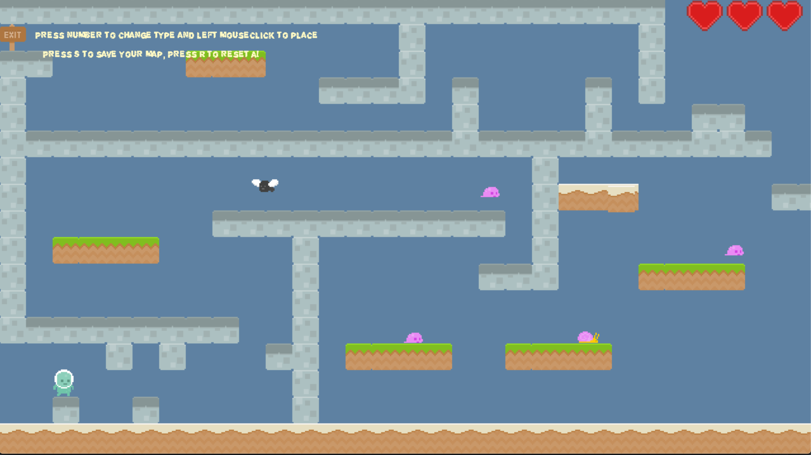
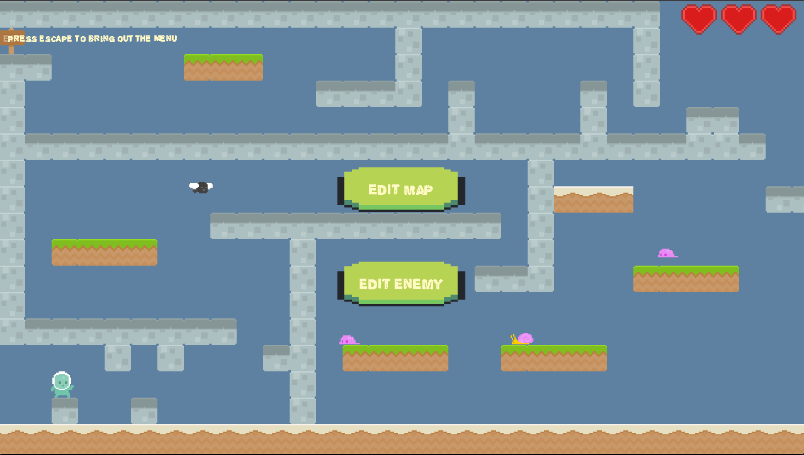
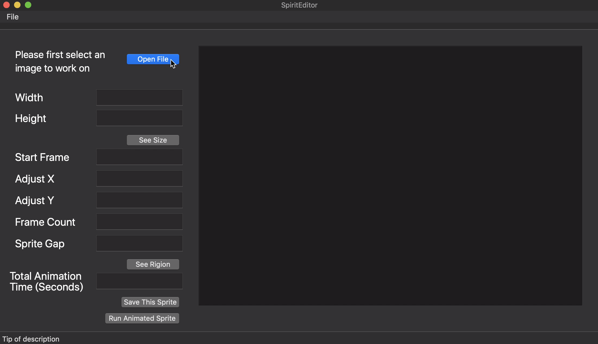
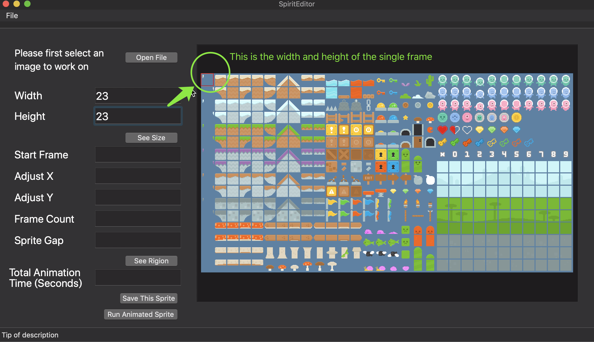
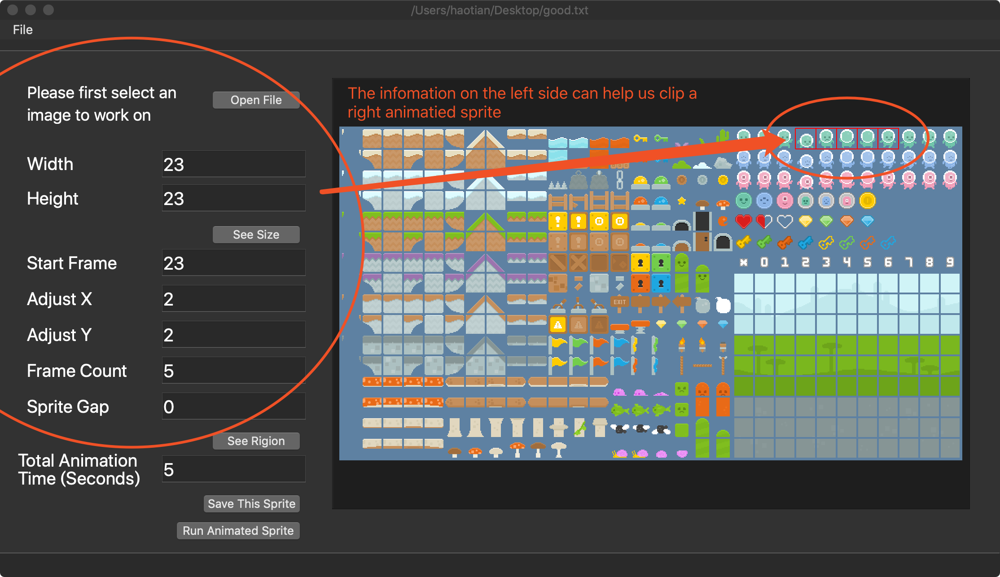
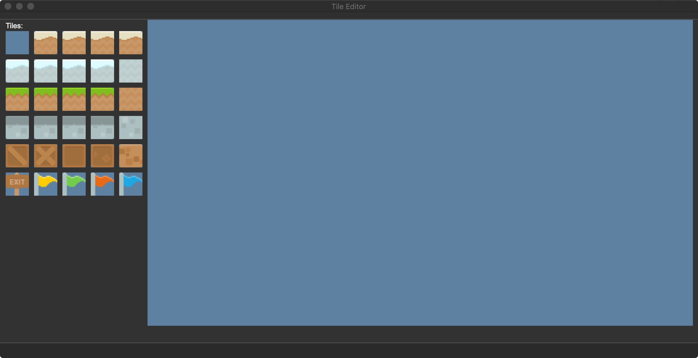
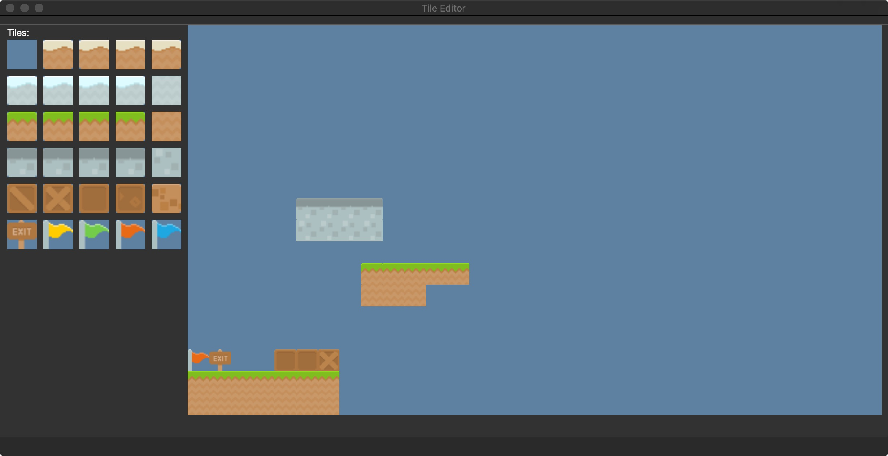

---
layout: default
---  

# Final Project

This is the Final Project for CS 5850.

An implementation of a platformer game maker using C++, SDL2 Libraries, QT and QT creator. 

## Team:
Created by Fan Ling, Hao Tian, Wendi Zhang

## Documentations and Download
[Link towards documentation](https://flynn2016.github.io/finalproject_doc)

[Link towards download](https://github.com/Spring19GameEngines/finalproject-pb/tree/master)

#### Install Instruction:  
Platform: MacOS

Download through the link provided on the website. Make sure you have SDL2, SDL2_image, SDL2_mixer and  SDL2_ttf in your library. Run main to open the game in terminal. 

#### README for SDL gamemaker
https://github.com/Spring19GameEngines/finalproject-pb/blob/fan/Project/README.md
#### README for sprite editor
https://github.com/Spring19GameEngines/finalproject-pb/blob/master/SpiritEditor/README.md
#### README for tile editor
https://github.com/Spring19GameEngines/finalproject-pb/blob/wendi/README_tile_editor.md

## Post Mortem 
Our project has three parts: sprite editor, tilemap editor, and a game maker. Each section can work separately and the game itself was built upon them.

SDL Game Maker:
So this is our plan B, our original intent was using QT creator to create a GUI to interact with SDL. We were working on our own part and everything was fine until we tried to combine our parts together. There some deployment error. No one can open other’s code in each other’s computer. We spent tons of time tried to figure it out, but eventually time ticked away and we decided to do Plan B a SDL version of our game maker with in game menu and editor.  I guess the biggest takeaway is making sure everything is working together every step of the way instead of trying to merge everything at last.

Sprite Editor:
Pros: 
Well formatted GUI inputs
With all the basic application functionalities (Open, new file, save, save as, etc. ...)
Visualized Image to tell users that see what exactly they are doing.
Cons:
Cannot interacting with the terminal and SDL directly.
Does not cut each sprite very precisely, and it might fail in some cases.

## Other Notes:
You can toggle the display of fps at the top of the GameManager.h file
And also we did not forget about the background. Like we said in the post mortem, we realized the spritesheet should have a transparent background too late. Right below the fps toggle, you can see there is a background toggle. Set it to true, you can view the background with the hideous square sprite.

### Video
<iframe width="560" height="315" src="https://www.youtube.com/embed/hgs5ZfBekn8" frameborder="0" allow="accelerometer; autoplay; encrypted-media; gyroscope; picture-in-picture" allowfullscreen></iframe>

### ScreenShots

