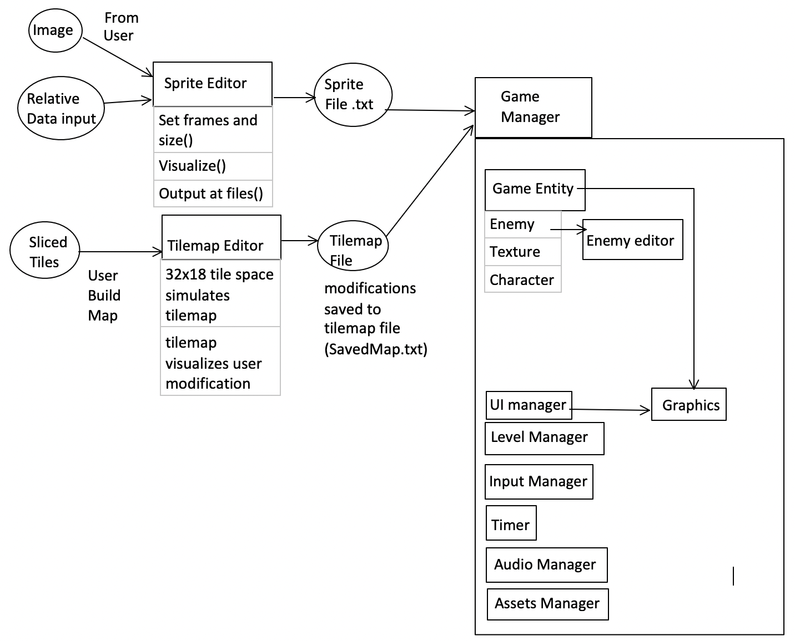

--- 
layout: default
---  

# Final Project

This is the Final Project for CS 5850.

An implementation of a platformer game maker using C++, SDL2 Libraries, QT and QT creator. 

## Team:
Created by Fan Ling, Hao Tian, Wendi Zhang

## Documentations and Download
[Link towards documentation](https://flynn2016.github.io/FinalProject_doc)

[Link towards download](https://github.com/Spring19GameEngines/finalproject-pb/tree/master)

#### Install Instruction:  
Platform: MacOS

Download through the link provided on the website. Make sure you have SDL2, SDL2_image, SDL2_mixer and  SDL2_ttf in your library. Run main to open the game in terminal. 

#### README for SDL gamemaker
https://github.com/Spring19GameEngines/finalproject-pb/blob/fan/Project/README.md
#### README for sprite editor
https://github.com/Spring19GameEngines/finalproject-pb/blob/master/SpiritEditor/README.md
#### README for tile editor
https://github.com/Spring19GameEngines/finalproject-pb/blob/wendi/README_tile_editor.md

## Diagram 

## Post Mortem 
Our project has three parts: sprite editor, tilemap editor, and a game maker. Each section can work separately and the game itself was built upon them.

We divided the project into three main “chunks” and each chose one to work on, with the intention to merge individual work all together at the end. Although we spent a lot of time trying all methods provided by QT’s website, online forums, and help from instructors, we still did not have any success merging everything together. Due to the difficulty we had and the limited time remaining, the project had to come in three parts: the sprite editor, tilemap editor, and game maker. We could have just sent source code files to each other and figure out how to combine into one project. But by the time when we started trying to merge everything, each of us already had a large amount of work done, and it was difficult to fit our different code structures together. As mentioned before, the lesson we learned throughout this process is that we should always think about how to merge work together at early stages of any project.

### SDL Gamemaker Video 
<iframe width="560" height="315" src="https://www.youtube.com/embed/pu8Gnf25rqk" frameborder="0" allow="accelerometer; autoplay; encrypted-media; gyroscope; picture-in-picture" allowfullscreen></iframe>

### Sprite Editor Video 
<iframe width="560" height="315" src="https://www.youtube.com/embed/hgs5ZfBekn8" frameborder="0" allow="accelerometer; autoplay; encrypted-media; gyroscope; picture-in-picture" allowfullscreen></iframe>

### ScreenShots

