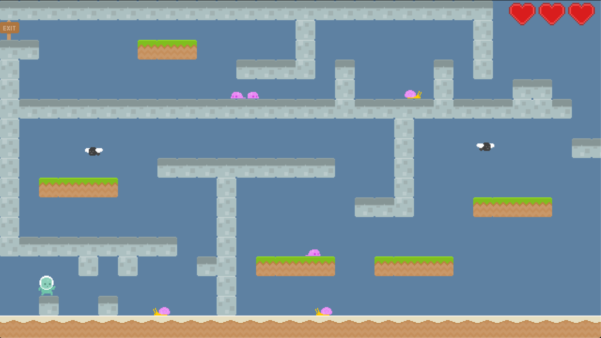
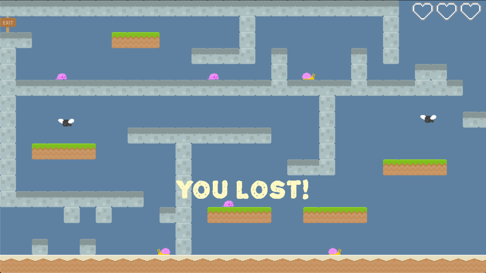
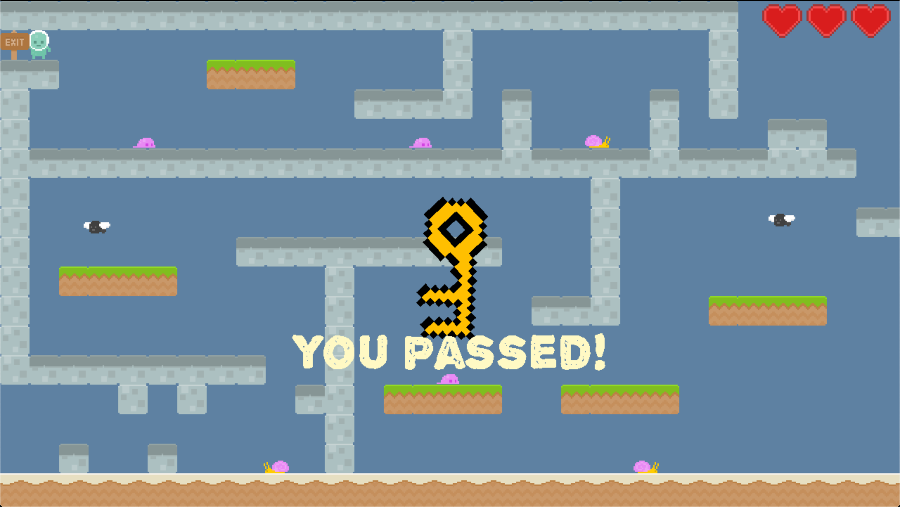

---
layout: default
--- 

# Platformer

This is the second project for CS 5850.

A implementation of the classic platformer game using C++ and SDL2 Libraries

## Team:
Created by Fan Ling, Hao Tian, Wendi Zhang

## Documentations and Download
[Link towards documentation](https://flynn2016.github.io/platformer_doc)

[Link towards download](https://troyprag816gmailcom.itch.io/sdl-platformer)

#### Install Instruction:  
Platform: MacOS

Download through the link provided on the website. Make sure you have SDL2, SDL2_image, SDL2_mixer and  SDL2_ttf in your library. Run main to open the game in terminal. Run sprite_editor to test the sprite editor and run tile_editor to test the tile editor.

## Post Mortem 

### Video
<iframe width="560" height="315" src="https://www.youtube.com/embed/_w32w-XguGk" frameborder="0" allow="accelerometer; autoplay; encrypted-media; gyroscope; picture-in-picture" allowfullscreen></iframe>

### ScreenShots

