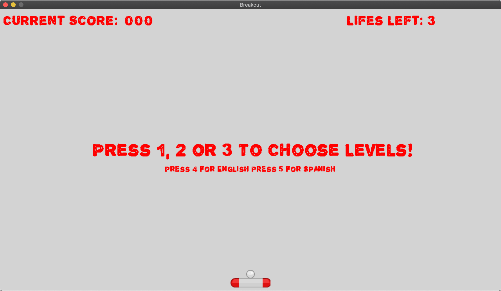
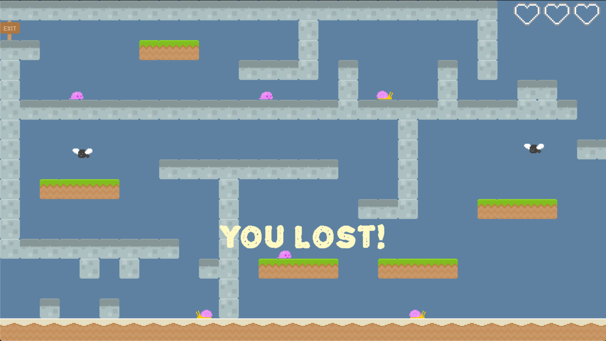
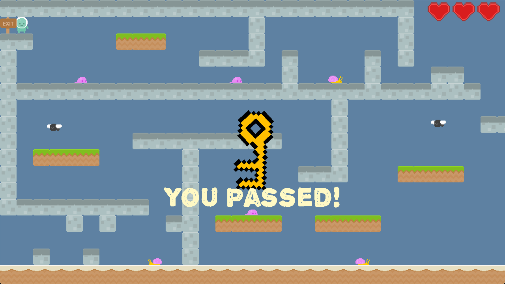

# Platformer

This is the first project for CS 5850.

A implementation of the classic game Breakout implemented using C++ and SDL2 Libraries

## Team:
Created by Fan Ling

## Documentations and Download
[Link towards documentation](https://flynn2016.github.io/breakout_doc)

[Link towards download](https://troyprag816gmailcom.itch.io/sdl-breakout)

#### Install Instruction:  
Platform: MacOS

Download through the link provided on the website. Make sure you have SDL2, SDL2_image, SDL2_mixer and  SDL2_ttf in your library. Run main in terminal to open the game.

## Post Mortem 
Since this is my time using SDL for a project, I learned a lot about 
the software structure of a game engine. The main and the most important 
takeaway is decoupling is essential. Decouple game logic from game engine, 
decouple manager from manager, decouple render from update. 

It may be very tempting to mash things together for easier life on implementation,
which I did a lot in this project due to time constraint. But it will make 
your code very hard to be reused by your future projects, let alone let others 
to use your code. The purpose of writing a game engine is to lay the software 
framework that can be used to build many games.

### Video
<iframe width="560" height="315" src="https://www.youtube.com/embed/_w32w-XguGk" frameborder="0" allow="accelerometer; autoplay; encrypted-media; gyroscope; picture-in-picture" allowfullscreen></iframe>

### ScreenShots

